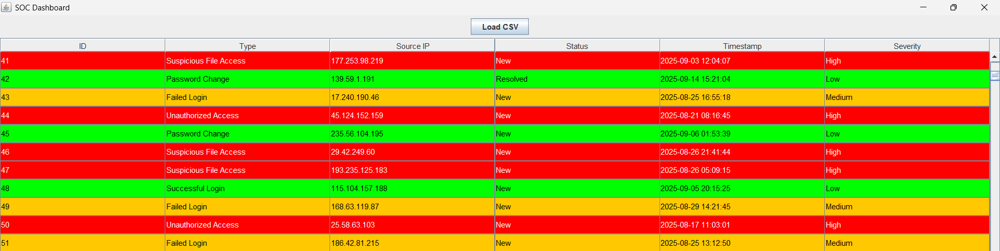

<h1 align="center">🛡️ SOC Dashboard</h1>
<h3 align="center">A Security Operations Center Incident Tracker Built in Java</h3>

<p align="center">
  
  
  
  
</p>

---

## ✨ Overview

**SOC Dashboard** is a desktop-based Security Operations Center (SOC) tool that allows monitoring of cybersecurity incidents. Users can import incident logs via CSV files, view them in a table, and track severity levels with color-coded visual cues. The tool also supports marking incidents as resolved, helping simulate real SOC operations.

---

## 🔥 Features

- 📊 Import and display incidents from CSV files
- 🔴🟠🟢 Severity-based row coloring for High, Medium, and Low threats
- 🖱 Click on incidents to view detailed information
- ✅ Mark incidents as resolved directly from the GUI
- 💾 SQLite database integration for persistent storage
- 🎨 Built with Java Swing for interactive GUI

---

## 🧰 Tech Stack

| Layer       | Technology          |
|-------------|-------------------|
| 💻 Frontend | Java Swing         |
| 🛠 Backend  | Java               |
| 🗃 Database | SQLite             |
| ⚙️ Logic    | CSV Parsing, JDBC  |
| ☁️ Hosting  | Local Desktop App  |

---

<details>
<summary>📁 Project Structure (Click to expand)</summary>

<pre>
SOC/
├── src/                         # Java source files
│   ├── SOCGUI.java              # Main GUI and logic
│   ├── SOCProject.java          # (static implementation)
│                   
├── lib/                         # JAR dependencies
│   └── sqlite-jdbc-3.42.0.0.jar
├── .gitignore                    # Ignore compiled files, IDE settings
├── README.md                     # You're here!
└── soc.db                        # SQLite database (optional, auto-created)
</pre>

</details>

---

## 🖼️ Screenshots

| Main Dashboard                               | Incident Details Window                     |
|----------------------------------------------|--------------------------------------------|
|  |  |

---

## 🚀 Getting Started

### 1️⃣ Clone the Repository

```bash
git clone https://github.com/your-username/SOC-Dashboard.git
cd SOC
```

---

### 2️⃣ Compile and Run

-Navigate to src folder.

```bash
cd src
```

- Now compile the GUI code and execute.

```bash
javac -cp ".;..\lib\sqlite-jdbc-3.50.3.0.jar" SOCGUI.java
java -cp ".;..\lib\sqlite-jdbc-3.50.3.0.jar" SOCGUI  
```

- Note : Use .: instead of .; on Linux/macOS

  ---

